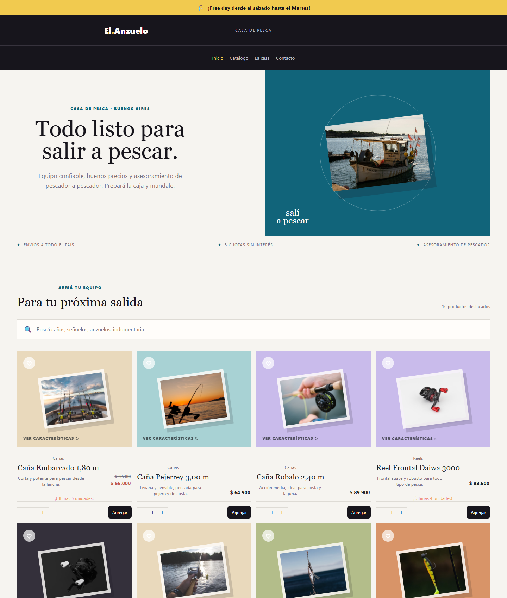

# El.Anzuelo · Casa de pesca

> **Proyecto académico** hecho para el curso **React JS de Talento Tech (comisión C26243)**, como entrega final.
> "El Anzuelo" es una tienda **ficticia**: los productos, precios, el equipo y los datos de contacto son de ejemplo.

**Sitio publicado:** https://react-final-eccomerce.netlify.app/



## De qué se trata

Una tienda online de artículos de pesca, hecha con React. Tiene un catálogo de productos, buscador, favoritos, carrito de compras y un panel de administración para gestionar productos, rubros, imágenes y avisos.

## Funcionalidades

**Tienda**
- Catálogo de productos agrupado por rubros (cañas y reels, señuelos, líneas y anzuelos, indumentaria), con precios de oferta y aviso de últimas unidades.
- Buscador de productos y tarjetas que se dan vuelta para ver las características.
- Favoritos y carrito de compras: se puede sumar o restar cantidades respetando el stock; favoritos y carrito se guardan en el navegador. El checkout es una simulación (no cobra ni registra pagos), valida nuevamente el stock en el servidor y lo descuenta de forma atómica en Firestore.
- Envío simulado por código postal o por localidad configurada, con tarifas fijas por zona desde `/admin/envios`; el retiro en tienda no tiene costo. Si el total de productos luego del descuento supera $300.000, el envío es gratis. Cuando aún no hay zonas guardadas, el panel muestra zonas y precios DEMO que deben revisarse y guardarse para usarse en el checkout.
- Franja de anuncio arriba de todo (por ejemplo, un "free day"), con fechas de inicio y fin y un descuento opcional que se aplica al total del carrito.
- Diseño adaptable: celular, tablet y escritorio hasta 1920 px; en pantallas más grandes aparece un fondo decorativo de pesca a los costados.

**Panel de administración** (`/admin`, con login)
- Alta, edición, baja y ocultamiento de productos, con carga de imágenes a ImgBB o por URL.
- Galería de imágenes por rubro: permite elegir imágenes ya usadas en productos del rubro o guardadas en la galería. Al reemplazar una imagen, la anterior se conserva para volver a usarla.
- Gestión de rubros y subrubros.
- Configuración de zonas de envío por rangos inclusivos de CP numéricos de 4 dígitos y/o localidades, sin rangos superpuestos ni localidades duplicadas. Incluye tarifas fijas en ARS y retiro en tienda sin costo.
- Edición del anuncio: texto, fechas, descuento y vista previa.

El login se realiza con Firebase Authentication. El catálogo, los avisos, las tarifas de envío y los enlaces de la galería se guardan en Cloud Firestore. Solo pueden entrar al panel las cuentas autorizadas en `admins/{uid}`.

Las imágenes se alojan en ImgBB; Firestore conserva sus URL y las relaciona con un rubro. Reemplazar una imagen no borra el archivo de ImgBB: la URL anterior queda disponible en la galería.

## Tecnologías

- [React 19](https://react.dev/) con [Vite](https://vite.dev/) y React Compiler
- [React Router](https://reactrouter.com/) para la navegación
- [React Bootstrap](https://react-bootstrap.github.io/) y CSS Modules para los estilos
- [Firebase](https://firebase.google.com/): Firestore para productos, rubros, anuncio y galería de imágenes; Authentication para el login del panel
- [ImgBB](https://imgbb.com/) para alojar las imágenes. Se suben mediante una Netlify Function en producción y un plugin de Vite en desarrollo; la clave se mantiene del lado del servidor
- El equipo se lee de `public/data/equipo.json`
- Netlify para alojar el sitio y publicar automáticamente los cambios que llegan a `main`

## Cómo correrlo en local

Se necesita [Node.js](https://nodejs.org/) 20.19 o superior (o 22.12+).

```bash
npm install
npm run dev
```

Se abre en http://localhost:5173/

Copiá `.env.example` como `.env.local` y completalo. `.env.local` no se sube al repositorio.

### Firebase (una sola vez)

1. Crear un proyecto en la [consola de Firebase](https://console.firebase.google.com/) y agregarle una app web. Su configuración va en [src/services/firebaseConfig.js](src/services/firebaseConfig.js) (no es secreta).
2. **Firestore Database**: crearla y, en *Reglas*, pegar y publicar el contenido de [firestore.rules](firestore.rules). La colección `imagenes` se crea automáticamente al guardar una imagen en la galería; para permitir su lectura y escritura, las reglas publicadas deben incluir la regla correspondiente.
3. **Authentication**: activar *Correo electrónico/contraseña* y crear el usuario admin (el mismo de `ADMIN_EMAIL` y `ADMIN_PASSWORD`).
4. En Firestore, crear la colección `admins` con un documento cuyo ID sea el *UID* de ese usuario (se ve en Authentication). Puede quedar sin campos.
5. `npm run cargar-datos` sube el catálogo y el anuncio iniciales de `scripts/datos/`.
6. Para simular compras con descuento de stock, creá una cuenta de servicio de Firebase con acceso de edición a Firestore y guardá su JSON completo en `FIREBASE_SERVICE_ACCOUNT_JSON`. En local va en `.env.local`; en Netlify, en *Site configuration → Environment variables*. Es una credencial privada: no la subas a Git, no uses el prefijo `VITE_` y no la compartas por chat.

| Comando | Qué hace |
| --- | --- |
| `npm run dev` | Servidor de desarrollo, con el panel de administración |
| `npm run build` | Genera la versión para publicar en `dist/` |
| `npm run preview` | Muestra la versión generada |
| `npm run lint` | Revisa el código con ESLint |
| `npm run cargar-datos` | Carga en Firestore el catálogo y el anuncio iniciales |
| `npm run cargar-envios-mock` | Carga las tarifas DEMO solo si `config/envios` está vacío |

## Publicación

Cada `git push` a la rama `main` compila el sitio y lo publica en Netlify (configuración en [netlify.toml](netlify.toml)). En Netlify deben estar configuradas las variables `IMGBB_KEY` y `FIREBASE_SERVICE_ACCOUNT_JSON`. La segunda se usa exclusivamente en la función de compras para validar y actualizar stock dentro de una transacción; no se expone al navegador. El endpoint rechaza pedidos con productos inactivos, cantidades inválidas o stock insuficiente. La configuración web de Firebase está en `src/services/firebaseConfig.js`; las reglas de Firestore se publican en Firebase, no desde Netlify, y no deben abrir escritura pública de productos.

La compra sigue siendo ficticia: no existe integración con pasarela, cobro ni registro de pedido. Por eso, en este proyecto de demostración, confirmar la simulación sí consume stock persistente. Las tarifas DEMO de envío pueden cargarse con `npm run cargar-envios-mock` si `config/envios` está vacío; el comando valida la sesión de administrador y verifica la escritura. Si ya existen tarifas, no las sobrescribe: gestioná cambios desde `/admin/envios`.

### Si la compra falla en producción

Cuando `/api/compras` responde 500, el detalle queda en el log de la función (*Netlify → Logs → Functions → compras*). Revisá en este orden:

1. **`Falta FIREBASE_SERVICE_ACCOUNT_JSON` o cuenta de servicio no válida**: la variable no está cargada en Netlify, no es el JSON completo o pertenece a otro proyecto. Después de cambiarla hay que volver a publicar (*Deploys → Trigger deploy*).
2. **`TypeError: ... is not a function`**: la función usa `firebase-admin`, no el SDK web. En el servidor `snapshot.exists` es una propiedad; `snapshot.exists()` solo existe en el navegador. Este error rompía las compras con envío a domicilio (el retiro en tienda funcionaba) y ya está corregido en [server/comprar.js](server/comprar.js).
3. **Precio, stock, descuento o zona inválidos**: el mensaje indica qué dato del catálogo corregir desde el panel de administración.

Las respuestas 400 y 409 (stock insuficiente, código postal sin tarifa, datos de envío incompletos) son validaciones esperadas y se muestran tal cual en el carrito.

## Autor

**Jorge Martinez** · Curso React JS · Talento Tech · Comisión C26243
